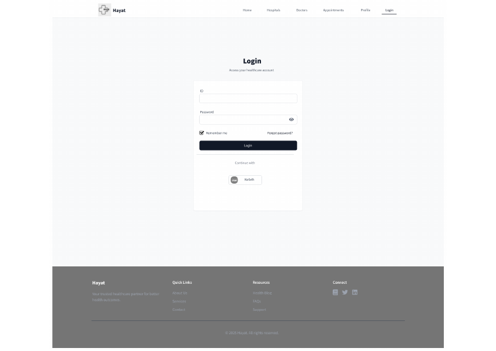
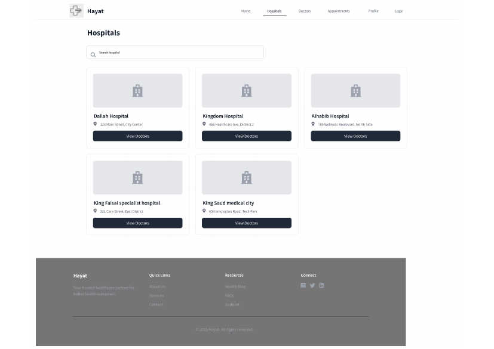
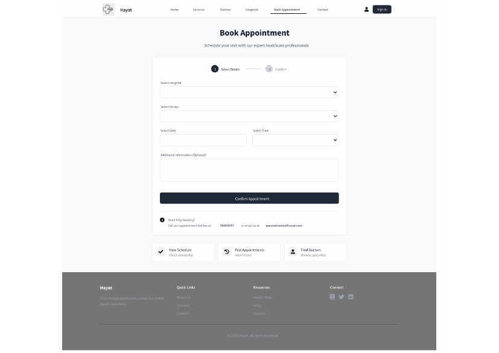

# Hayat — Web Platform

The web-based companion to the [Hayat](https://github.com/ahmim770/hayat-app) hospital app, built for
a Web Design course (IS311). A patient/doctor/admin portal for hospital search, doctor listings, and
appointment booking, backed by a MySQL database and a Node.js/Express API with authentication.

## Pages

<p float="left">
  
  
  
</p>

| Page | Purpose |
|---|---|
| `index.html` | Landing page |
| `login.html` | Sign in |
| `hospitals.html` | Browse hospitals |
| `doctors.html` | Browse doctors |
| `appointment.html` | Book an appointment |
| `profile.html` | Patient/doctor/admin profile |

## Backend

`server.js` is an Express API using:

- `mysql2` — connects to the `hayat` MySQL database (`hayat_database.sql`)
- `bcryptjs` — password hashing
- `jsonwebtoken` + `cookie-parser` — session auth
- `dotenv` — configuration via a local `.env` (see `legacy/phase4-nodejs/.env.example` for the
  expected variables — `DB_HOST`, `DB_PORT`, `DB_USER`, `DB_PASSWORD`, `DB_NAME`, `PORT`, `JWT_SECRET`)

### Running it locally

```bash
npm install
cp legacy/phase4-nodejs/.env.example .env   # then fill in your own DB credentials
npm start
```

## Database schema

`hayat_database.sql` defines five tables: `users`, `hospitals`, `patients`, `doctors`, and
`appointments` — covering role-based accounts (`patient` / `doctor` / `admin`), hospital directory
data, and the doctor↔patient appointment relationship.

## Project history

This repo tracks the platform through its course phases:

- **Phase 1** — initial proposal/report ([`docs/Phase1 submission.pdf`](docs/Phase1%20submission.pdf))
- **Phase 2** — static HTML/CSS front end, kept under `legacy/phase2/`
- **Phase 4** — first Node.js/Express + MySQL backend, kept under `legacy/phase4-nodejs/`
- **Phase 5 (current)** — the version at the repo root: full authentication (bcrypt + JWT), cookie
  sessions, and the complete page set above

## Tech

Node.js, Express, MySQL, HTML/CSS/JS

---
Part of the [ahmim770.github.io](https://ahmim770.github.io) portfolio · see also [hayat-app](https://github.com/ahmim770/hayat-app)
